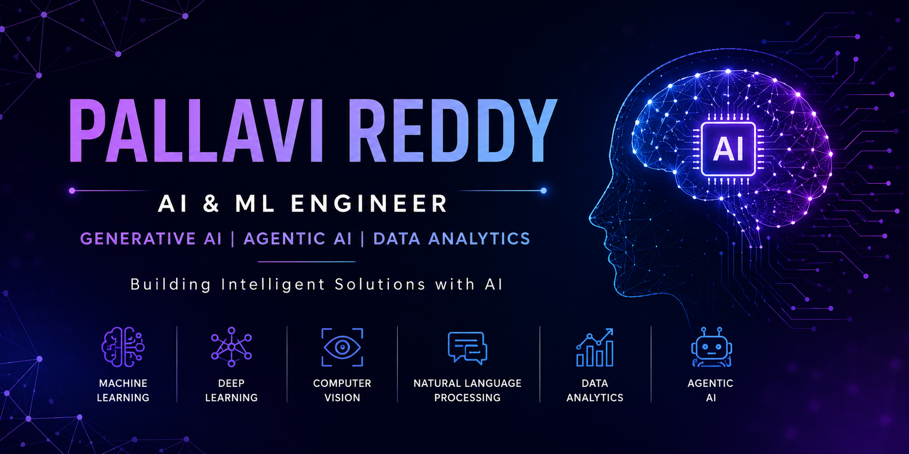

  

# Hi 👋, I'm Pallavi Reddy

### 🚀 AI & ML Engineer (Aspiring) | 🤖 Generative AI Enthusiast | 🐍 Python Developer

I am an Engineering student passionate about **Artificial Intelligence, Machine Learning, Generative AI, and Agentic AI systems**. I enjoy building intelligent applications that solve real-world problems through Machine Learning, Computer Vision, and Large Language Models.

---

## 👩‍💻 About Me

🎓 Engineering Student specializing in Artificial Intelligence & Machine Learning

🤖 Passionate about AI, Machine Learning, Generative AI, and Agentic AI

🌱 Continuously learning and building AI-powered solutions

💡 Strong interest in solving real-world problems using data and intelligent systems

🎯 Career Goal: Become an AI/ML Engineer building impactful AI applications at scale

---

## 🛠️ Tech Stack

### 💻 Programming Languages

* 🐍 Python
* ☕ Java
* 🗄️ SQL

### 🤖 AI / Machine Learning

* Machine Learning
* Deep Learning
* Computer Vision
* Natural Language Processing (NLP)
* Scikit-Learn
* TensorFlow

### 🧠 Generative AI

* Large Language Models (LLMs)
* Prompt Engineering
* Retrieval-Augmented Generation (RAG)
* LangChain
* AI Agents

### 📊 Data Analytics & Visualization

* Pandas
* NumPy
* Matplotlib
* Power BI

### ⚙️ Tools & Platforms

* Git
* GitHub
* VS Code
* Google Colab
* Jupyter Notebook

---

## 🧠 Core AI/ML Areas

🔹 Machine Learning

🔹 Deep Learning

🔹 Computer Vision

🔹 Natural Language Processing

🔹 Generative AI

🔹 Agentic AI

🔹 Data Analytics

🔹 Predictive Modeling

---

## 🚀 Currently Working On

🌾 AI Harvest Post Detection using Computer Vision

🤖 Agentic AI Applications with LLMs

📄 Resume Analyzer using Machine Learning

🧠 Learning RAG & LangChain

📈 Advanced Machine Learning & Deep Learning

---

## 📌 Featured Projects

### 🌾 AI Harvest Post Detection

Computer Vision solution for agricultural analysis and crop monitoring using deep learning techniques.

### 🤖 AI Career Assistant

AI-powered assistant that helps students with internship guidance, career suggestions, and resume recommendations.

### 📄 Resume Analyzer

Machine Learning application that analyzes resumes and provides ATS-friendly suggestions for improvement.

### 👁️ Fruit Quality Detection

Computer Vision project that identifies fruit quality, freshness, and defects through image analysis.

---

## 🎯 2026 Goals

✅ Build advanced AI/ML projects

✅ Master Generative AI & Agentic AI

✅ Contribute to Open Source

✅ Secure impactful AI/ML internships

✅ Build production-ready AI applications

✅ Strengthen Data Structures & Algorithms

✅ Develop end-to-end AI products

---

## 💭 Philosophy

> "Learn continuously. Build consistently. Improve daily."

---

## 🌐 Connect With Me

💼 LinkedIn: (https://www.linkedin.com/in/pallavi-reddy-4865703a9/)

📧 Email: marikantipallavireddy@gmail.com

🐙 GitHub: pallav12-code

---

### ✨ Learning • Building • Innovating ✨

